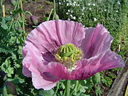
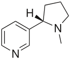
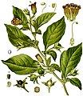
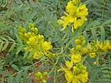
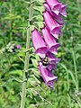
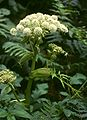
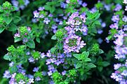
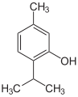

<strong>Phytochemicals</strong>&nbsp;are&nbsp;<a title="Chemical compound" href="https://en.wikipedia.org/wiki/Chemical_compound">chemical compounds</a>&nbsp;produced by&nbsp;<a title="Plant" href="https://en.wikipedia.org/wiki/Plant">plants</a>, generally to help them thrive or thwart competitors, predators, or pathogens. The name comes from&nbsp;<a title="Greek language" href="https://en.wikipedia.org/wiki/Greek_language">Greek</a>&nbsp;<a class="extiw" title="wikt:&phi;&upsilon;&tau;ό&nu;" href="https://en.wiktionary.org/wiki/%CF%86%CF%85%CF%84%CF%8C%CE%BD">&phi;&upsilon;&tau;ό&nu;</a><em>&nbsp;(phyton)</em>, meaning 'plant'. Some phytochemicals have been used as&nbsp;<a title="Poison" href="https://en.wikipedia.org/wiki/Poison">poisons</a>&nbsp;and others as&nbsp;<a title="Traditional medicine" href="https://en.wikipedia.org/wiki/Traditional_medicine">traditional medicine</a>.

As a term,&nbsp;<em>phytochemicals</em>&nbsp;is generally used to describe plant compounds that are under research with unestablished effects on health and are not scientifically defined as&nbsp;<a class="mw-redirect" title="Essential nutrients" href="https://en.wikipedia.org/wiki/Essential_nutrients">essential nutrients</a>. Regulatory agencies governing food labeling in Europe and the United States have provided guidance for industry limiting or preventing&nbsp;<a title="Health claim" href="https://en.wikipedia.org/wiki/Health_claim">health claims</a>&nbsp;about phytochemicals on food&nbsp;<a title="Nutrition facts label" href="https://en.wikipedia.org/wiki/Nutrition_facts_label">product or nutrition labels</a>. The major classes of pharmacologically active&nbsp;<a title="Phytochemical" href="https://en.wikipedia.org/wiki/Phytochemical">phytochemicals</a>&nbsp;are described below, with examples of medicinal plants that contain them.&nbsp;Human settlements are often surrounded by weeds useful as medicines, such as&nbsp;<a title="Urtica dioica" href="https://en.wikipedia.org/wiki/Urtica_dioica">nettle</a>,&nbsp;<a class="mw-redirect" title="Dandelion" href="https://en.wikipedia.org/wiki/Dandelion">dandelion</a>&nbsp;and&nbsp;<a class="mw-redirect" title="Chickweed" href="https://en.wikipedia.org/wiki/Chickweed">chickweed</a>.

Many phytochemicals, including&nbsp;<a title="Curcumin" href="https://en.wikipedia.org/wiki/Curcumin">curcumin</a>,&nbsp;<a title="Epigallocatechin gallate" href="https://en.wikipedia.org/wiki/Epigallocatechin_gallate">epigallocatechin gallate</a>,&nbsp;<a title="Genistein" href="https://en.wikipedia.org/wiki/Genistein">genistein</a>&nbsp;and&nbsp;<a title="Resveratrol" href="https://en.wikipedia.org/wiki/Resveratrol">resveratrol</a>&nbsp;are&nbsp;<a title="Pan-assay interference compounds" href="https://en.wikipedia.org/wiki/Pan-assay_interference_compounds">pan-assay interference compounds</a>&nbsp;and are not useful in&nbsp;<a title="Drug discovery" href="https://en.wikipedia.org/wiki/Drug_discovery">drug discovery</a>.

<h3>Alkaloids</h3>

<a class="mw-redirect" title="Alkaloids" href="https://en.wikipedia.org/wiki/Alkaloids">Alkaloids</a>&nbsp;are bitter-tasting chemicals, very widespread in nature, and often toxic. There are several classes with different modes of action as drugs, both recreational and pharmaceutical. Medicines of different classes include&nbsp;<a title="Atropine" href="https://en.wikipedia.org/wiki/Atropine">atropine</a>,&nbsp;<a class="mw-redirect" title="Scopolamine" href="https://en.wikipedia.org/wiki/Scopolamine">scopolamine</a>, and&nbsp;<a title="Hyoscyamine" href="https://en.wikipedia.org/wiki/Hyoscyamine">hyoscyamine</a>&nbsp;(all from&nbsp;<a class="mw-redirect" title="Nightshade" href="https://en.wikipedia.org/wiki/Nightshade">nightshade</a>),&nbsp;the traditional medicine&nbsp;<a title="Berberine" href="https://en.wikipedia.org/wiki/Berberine">berberine</a>&nbsp;(from plants such as&nbsp;<em><a title="Berberis" href="https://en.wikipedia.org/wiki/Berberis">Berberis</a></em>&nbsp;and&nbsp;<em><a title="Mahonia" href="https://en.wikipedia.org/wiki/Mahonia">Mahonia</a></em>),&nbsp;<a title="Caffeine" href="https://en.wikipedia.org/wiki/Caffeine">caffeine</a>&nbsp;(<em><a title="Coffea" href="https://en.wikipedia.org/wiki/Coffea">Coffea</a></em>),&nbsp;<a title="Cocaine" href="https://en.wikipedia.org/wiki/Cocaine">cocaine</a>&nbsp;(<em><a title="Coca" href="https://en.wikipedia.org/wiki/Coca">Coca</a></em>),&nbsp;<a title="Ephedrine" href="https://en.wikipedia.org/wiki/Ephedrine">ephedrine</a>&nbsp;(<em><a title="Ephedra (plant)" href="https://en.wikipedia.org/wiki/Ephedra_(plant)">Ephedra</a></em>),&nbsp;<a title="Morphine" href="https://en.wikipedia.org/wiki/Morphine">morphine</a>&nbsp;(<a class="mw-redirect" title="Opium poppy" href="https://en.wikipedia.org/wiki/Opium_poppy">opium poppy</a>),&nbsp;<a title="Nicotine" href="https://en.wikipedia.org/wiki/Nicotine">nicotine</a>&nbsp;(<a title="Tobacco" href="https://en.wikipedia.org/wiki/Tobacco">tobacco</a>),&nbsp;<a title="Reserpine" href="https://en.wikipedia.org/wiki/Reserpine">reserpine</a>&nbsp;(<em><a title="Rauvolfia serpentina" href="https://en.wikipedia.org/wiki/Rauvolfia_serpentina">Rauvolfia serpentina</a></em>),&nbsp;<a title="Quinidine" href="https://en.wikipedia.org/wiki/Quinidine">quinidine</a>&nbsp;and&nbsp;<a title="Quinine" href="https://en.wikipedia.org/wiki/Quinine">quinine</a>&nbsp;(<em><a title="Cinchona" href="https://en.wikipedia.org/wiki/Cinchona">Cinchona</a></em>),&nbsp;<a title="Vincamine" href="https://en.wikipedia.org/wiki/Vincamine">vincamine</a>&nbsp;(<em><a title="Vinca minor" href="https://en.wikipedia.org/wiki/Vinca_minor">Vinca minor</a></em>), and&nbsp;<a title="Vincristine" href="https://en.wikipedia.org/wiki/Vincristine">vincristine</a>&nbsp;(<em><a title="Catharanthus roseus" href="https://en.wikipedia.org/wiki/Catharanthus_roseus">Catharanthus roseus</a></em>).

<ul class="gallery mw-gallery-nolines">
<li class="gallerybox">

The opium poppy&nbsp;<em><a title="Papaver somniferum" href="https://en.wikipedia.org/wiki/Papaver_somniferum">Papaver somniferum</a></em>&nbsp;is the source of the&nbsp;<a class="mw-redirect" title="Alkaloids" href="https://en.wikipedia.org/wiki/Alkaloids">alkaloids</a>&nbsp;<a title="Morphine" href="https://en.wikipedia.org/wiki/Morphine">morphine</a>&nbsp;and&nbsp;<a title="Codeine" href="https://en.wikipedia.org/wiki/Codeine">codeine</a>.

</li>
&nbsp;
<li class="gallerybox">

The alkaloid&nbsp;<a title="Nicotine" href="https://en.wikipedia.org/wiki/Nicotine">nicotine</a>&nbsp;from&nbsp;<a title="Tobacco" href="https://en.wikipedia.org/wiki/Tobacco">tobacco</a>&nbsp;binds directly to the body's&nbsp;<a title="Nicotinic acetylcholine receptor" href="https://en.wikipedia.org/wiki/Nicotinic_acetylcholine_receptor">Nicotinic acetylcholine receptors</a>, accounting for its pharmacological effects.

</li>
&nbsp;
<li class="gallerybox">

<a class="mw-redirect" title="Deadly nightshade" href="https://en.wikipedia.org/wiki/Deadly_nightshade">Deadly nightshade</a>,&nbsp;<em>Atropa belladonna</em>, yields&nbsp;<a title="Tropane alkaloid" href="https://en.wikipedia.org/wiki/Tropane_alkaloid">tropane alkaloids</a>&nbsp;including&nbsp;<a title="Atropine" href="https://en.wikipedia.org/wiki/Atropine">atropine</a>,&nbsp;<a class="mw-redirect" title="Scopolamine" href="https://en.wikipedia.org/wiki/Scopolamine">scopolamine</a>&nbsp;and&nbsp;<a title="Hyoscyamine" href="https://en.wikipedia.org/wiki/Hyoscyamine">hyoscyamine</a>.

</li>
</ul>
<h3>Glycosides</h3>

<a title="Anthraquinone" href="https://en.wikipedia.org/wiki/Anthraquinone">Anthraquinone</a>&nbsp;<a class="mw-redirect" title="Glycosides" href="https://en.wikipedia.org/wiki/Glycosides">glycosides</a>&nbsp;are found in the&nbsp;<a title="Laxative" href="https://en.wikipedia.org/wiki/Laxative">laxatives</a>&nbsp;<a class="mw-redirect" title="Senna (herb)" href="https://en.wikipedia.org/wiki/Senna_(herb)">senna</a>,&nbsp;<a title="Rhubarb" href="https://en.wikipedia.org/wiki/Rhubarb">rhubarb</a>&nbsp;and&nbsp;<em><a title="Aloe" href="https://en.wikipedia.org/wiki/Aloe">Aloe</a></em>.

The&nbsp;<a title="Cardiac glycoside" href="https://en.wikipedia.org/wiki/Cardiac_glycoside">cardiac glycosides</a>&nbsp;are powerful drugs from plants including&nbsp;<a class="mw-redirect" title="Foxglove" href="https://en.wikipedia.org/wiki/Foxglove">foxglove</a>&nbsp;and&nbsp;<a title="Lily of the valley" href="https://en.wikipedia.org/wiki/Lily_of_the_valley">lily of the valley</a>. They include&nbsp;<a title="Digoxin" href="https://en.wikipedia.org/wiki/Digoxin">digoxin</a>&nbsp;and&nbsp;<a title="Digitoxin" href="https://en.wikipedia.org/wiki/Digitoxin">digitoxin</a>&nbsp;which support the beating of the heart, and act as&nbsp;<a title="Diuretic" href="https://en.wikipedia.org/wiki/Diuretic">diuretics</a>.

<ul class="gallery mw-gallery-nolines">
<li class="gallerybox">

<em><a title="Senna alexandrina" href="https://en.wikipedia.org/wiki/Senna_alexandrina">Senna alexandrina</a></em>, containing&nbsp;<a class="mw-redirect" title="Senna glycosides" href="https://en.wikipedia.org/wiki/Senna_glycosides">anthraquinone glycosides</a>, has been used as a&nbsp;<a title="Laxative" href="https://en.wikipedia.org/wiki/Laxative">laxative</a>&nbsp;for millennia.

</li>
&nbsp;
<li class="gallerybox">

The&nbsp;<a class="mw-redirect" title="Foxglove" href="https://en.wikipedia.org/wiki/Foxglove">foxglove</a>,&nbsp;<em>Digitalis purpurea</em>, contains&nbsp;<a title="Digoxin" href="https://en.wikipedia.org/wiki/Digoxin">digoxin</a>, a&nbsp;<a title="Cardiac glycoside" href="https://en.wikipedia.org/wiki/Cardiac_glycoside">cardiac glycoside</a>. The plant was used to treat heart conditions long before the glycoside was identified.

</li>
&nbsp;
<li class="gallerybox">

<a title="Digoxin" href="https://en.wikipedia.org/wiki/Digoxin">Digoxin</a>&nbsp;is used to treat&nbsp;<a title="Atrial fibrillation" href="https://en.wikipedia.org/wiki/Atrial_fibrillation">atrial fibrillation</a>,&nbsp;<a title="Atrial flutter" href="https://en.wikipedia.org/wiki/Atrial_flutter">atrial flutter</a>&nbsp;and sometimes&nbsp;<a title="Heart failure" href="https://en.wikipedia.org/wiki/Heart_failure">heart failure</a>.

</li>
</ul>
<h3>Polyphenols</h3>

<a title="Polyphenol" href="https://en.wikipedia.org/wiki/Polyphenol">Polyphenols</a>&nbsp;of several classes are widespread in plants. They include the colourful&nbsp;<a title="Anthocyanin" href="https://en.wikipedia.org/wiki/Anthocyanin">anthocyanins</a>, hormone-mimicking&nbsp;<a title="Phytoestrogen" href="https://en.wikipedia.org/wiki/Phytoestrogen">phytoestrogens</a>, and astringent&nbsp;<a title="Tannin" href="https://en.wikipedia.org/wiki/Tannin">tannins</a>.&nbsp;In&nbsp;<a title="Ayurveda" href="https://en.wikipedia.org/wiki/Ayurveda">Ayurveda</a>, the astringent rind of the&nbsp;<a title="Pomegranate" href="https://en.wikipedia.org/wiki/Pomegranate">pomegranate</a>&nbsp;is used as a medicine,&nbsp;while polyphenol extracts from plant materials such as grape seeds are sold&nbsp;<a class="mw-redirect" title="Health effects of natural phenols and polyphenols" href="https://en.wikipedia.org/wiki/Health_effects_of_natural_phenols_and_polyphenols">for their potential health benefits</a>&nbsp;They have been continually studied in cell cultures for their different anti-cancer effects.

Plants containing phytoestrogens have been used for centuries to treat gynaecological disorders such as fertility, menstrual, and menopausal problems.&nbsp;Among these plants are&nbsp;<em><a title="Pueraria" href="https://en.wikipedia.org/wiki/Pueraria">Pueraria</a>&nbsp;mirifica</em>,&nbsp;<a title="Kudzu" href="https://en.wikipedia.org/wiki/Kudzu">kudzu</a>,&nbsp;<a title="Angelica" href="https://en.wikipedia.org/wiki/Angelica">angelica</a>,&nbsp;<a title="Fennel" href="https://en.wikipedia.org/wiki/Fennel">fennel</a>, and&nbsp;<a title="Anise" href="https://en.wikipedia.org/wiki/Anise">anise</a>.

<ul class="gallery mw-gallery-nolines">
<li class="gallerybox">

<a title="Angelica sylvestris" href="https://en.wikipedia.org/wiki/Angelica_sylvestris">Angelica</a>, containing&nbsp;<a title="Phytoestrogen" href="https://en.wikipedia.org/wiki/Phytoestrogen">phytoestrogens</a>, has long been used to treat gynaecological disorders.

</li>
&nbsp;
<li class="gallerybox">

<a title="Polyphenol" href="https://en.wikipedia.org/wiki/Polyphenol">Polyphenols</a>&nbsp;include&nbsp;<a title="Phytoestrogen" href="https://en.wikipedia.org/wiki/Phytoestrogen">phytoestrogens</a>&nbsp;(top and middle), effective mimics of animal&nbsp;<a title="Estrogen" href="https://en.wikipedia.org/wiki/Estrogen">estrogen</a>&nbsp;(bottom).

</li>
</ul>
<h3>Terpenes</h3>

<a class="mw-redirect" title="Terpenes" href="https://en.wikipedia.org/wiki/Terpenes">Terpenes</a>&nbsp;and&nbsp;<a class="mw-redirect" title="Terpenoids" href="https://en.wikipedia.org/wiki/Terpenoids">terpenoids</a>&nbsp;of many kinds are found in&nbsp;<a title="Resin" href="https://en.wikipedia.org/wiki/Resin">resinous</a>&nbsp;plants such as the&nbsp;<a class="mw-redirect" title="Conifers" href="https://en.wikipedia.org/wiki/Conifers">conifers</a>. They are strongly aromatic and serve to repel herbivores. Their scent makes them useful in&nbsp;<a class="mw-redirect" title="Essential oils" href="https://en.wikipedia.org/wiki/Essential_oils">essential oils</a>, whether for&nbsp;<a title="Perfume" href="https://en.wikipedia.org/wiki/Perfume">perfumes</a>&nbsp;such as&nbsp;<a title="Rose" href="https://en.wikipedia.org/wiki/Rose">rose</a>&nbsp;and&nbsp;<a class="mw-redirect" title="Lavender" href="https://en.wikipedia.org/wiki/Lavender">lavender</a>, or for&nbsp;<a title="Aromatherapy" href="https://en.wikipedia.org/wiki/Aromatherapy">aromatherapy</a>.&nbsp;Some have had medicinal uses:&nbsp;<a title="Thymol" href="https://en.wikipedia.org/wiki/Thymol">thymol</a>&nbsp;is an antiseptic and was once used as a&nbsp;<a class="mw-redirect" title="Vermifuge" href="https://en.wikipedia.org/wiki/Vermifuge">vermifuge</a>&nbsp;(anti-worm medicine).

<ul class="gallery mw-gallery-nolines">
<li class="gallerybox">

The&nbsp;<a title="Essential oil" href="https://en.wikipedia.org/wiki/Essential_oil">essential oil</a>&nbsp;of&nbsp;<a class="mw-redirect" title="Common thyme" href="https://en.wikipedia.org/wiki/Common_thyme">common thyme</a>&nbsp;(<em>Thymus vulgaris</em>), contains the&nbsp;<a title="Monoterpene" href="https://en.wikipedia.org/wiki/Monoterpene">monoterpene</a>&nbsp;<a title="Thymol" href="https://en.wikipedia.org/wiki/Thymol">thymol</a>, an&nbsp;<a title="Antiseptic" href="https://en.wikipedia.org/wiki/Antiseptic">antiseptic</a>&nbsp;and&nbsp;<a class="mw-redirect" title="Antifungal medication" href="https://en.wikipedia.org/wiki/Antifungal_medication">antifungal</a>.

</li>
&nbsp;
<li class="gallerybox">

Thymol is one of many&nbsp;<a title="Terpene" href="https://en.wikipedia.org/wiki/Terpene">terpenes</a>&nbsp;found in plants.

</li>
</ul>

 

<h2 id ="Books">Books </h2>
<ul>

 <li><a target="_blank" href="https://github.com/manjunath5496/Phytochemicals/blob/master/pyt(1).pdf" style="text-decoration:none;">Phytochemical and Pharmacological Aspects of Australian Plectranthus sp.</a></li>
                            
 <li><a target="_blank" href="https://github.com/manjunath5496/Phytochemicals/blob/master/pyt(2).pdf" style="text-decoration:none;">Antioxidant Phytochemicals at the Pharma-Nutrition Interface</a></li>

<li><a target="_blank" href="https://github.com/manjunath5496/Phytochemicals/blob/master/pyt(3).pdf" style="text-decoration:none;">Phytochemicals as a Source of Novel Drugs Against Prostate Cancer – Preparation of Animal Experiments and Isolation and Identification of Flavonoid Glycosides from Abies pindrow</a></li>
 <li><a target="_blank" href="https://github.com/manjunath5496/Phytochemicals/blob/master/pyt(4).pdf" style="text-decoration:none;">Active Phytochemicals from Chinese Herbal Medicines: Anti-Cancer Activities and Mechanisms</a></li>                              
<li><a target="_blank" href="https://github.com/manjunath5496/Phytochemicals/blob/master/pyt(5).pdf" style="text-decoration:none;">Analysis of Antioxidant-Rich Phytochemicals</a></li>

 <li><a target="_blank" href="https://github.com/manjunath5496/Phytochemicals/blob/master/pyt(6).pdf" style="text-decoration:none;">Handbook of Plant Food Phytochemicals</a></li>
                            
 <li><a target="_blank" href="https://github.com/manjunath5496/Phytochemicals/blob/master/pyt(7).pdf" style="text-decoration:none;">Dietary Phytochemicals and Microbes</a></li>

<li><a target="_blank" href="https://github.com/manjunath5496/Phytochemicals/blob/master/pyt(8).pdf" style="text-decoration:none;">Biology of Soil Science</a></li>
 <li><a target="_blank" href="https://github.com/manjunath5496/Phytochemicals/blob/master/pyt(9).pdf" style="text-decoration:none;">Dried Fruits: Phytochemicals and Health Effects</a></li>                              
<li><a target="_blank" href="https://github.com/manjunath5496/Phytochemicals/blob/master/pyt(10).pdf" style="text-decoration:none;">Phytochemical Investigation of Euphorbia, Pouzolzia and Pavetta Species from Kumaon Himalayas</a></li>

 <li><a target="_blank" href="https://github.com/manjunath5496/Phytochemicals/blob/master/pyt(11).pdf" style="text-decoration:none;">Focus On Phytochemical Pesticides</a></li>
                            
 <li><a target="_blank" href="https://github.com/manjunath5496/Phytochemicals/blob/master/pyt(12).pdf" style="text-decoration:none;"> Fruit and Vegetable Phytochemicals: Chemistry, Nutritional Value, and Stability</a></li>

<li><a target="_blank" href="https://github.com/manjunath5496/Phytochemicals/blob/master/pyt(13).pdf" style="text-decoration:none;">  Functionality of Food Phytochemicals</a></li>
 <li><a target="_blank" href="https://github.com/manjunath5496/Phytochemicals/blob/master/pyt(14).pdf" style="text-decoration:none;"> Mitochondria as Targets for Phytochemicals in Cancer Prevention and Therapy</a></li>                              
<li><a target="_blank" href="https://github.com/manjunath5496/Phytochemicals/blob/master/pyt(15).pdf" style="text-decoration:none;">Modern Phytochemical Methods</a></li>

 <li><a target="_blank" href="https://github.com/manjunath5496/Phytochemicals/blob/master/pyt(16).pdf" style="text-decoration:none;">Biology of Disease</a></li>
                            
 <li><a target="_blank" href="https://github.com/manjunath5496/Phytochemicals/blob/master/pyt(17).pdf" style="text-decoration:none;">The Handy Biology Answer Book</a></li>

<li><a target="_blank" href="https://github.com/manjunath5496/Phytochemicals/blob/master/pyt(18).pdf" style="text-decoration:none;">Bioinformatics and Computational Biology Solutions Using R and Bioconductor</a></li>
 <li><a target="_blank" href="https://github.com/manjunath5496/Phytochemicals/blob/master/pyt(19).pdf" style="text-decoration:none;">Biology of Marine Birds</a></li>                              
<li><a target="_blank" href="https://github.com/manjunath5496/Phytochemicals/blob/master/pyt(20).pdf" style="text-decoration:none;"> Are We Smart Enough to Know How Smart Animals Are?</a></li>

 <li><a target="_blank" href="https://github.com/manjunath5496/Phytochemicals/blob/master/pyt(21).pdf" style="text-decoration:none;">Systems Biology: A Textbook</a></li>
                            
 <li><a target="_blank" href="https://github.com/manjunath5496/Phytochemicals/blob/master/pyt(22).pdf" style="text-decoration:none;">Cell Biology Protocols</a></li>

<li><a target="_blank" href="https://github.com/manjunath5496/Phytochemicals/blob/master/pyt(23).pdf" style="text-decoration:none;">A Level Biology for AQA</a></li>
 <li><a target="_blank" href="https://github.com/manjunath5496/Phytochemicals/blob/master/pyt(24).pdf" style="text-decoration:none;">Chemical and Biological Synthesis: Enabling Approaches for Understanding Biology</a></li>                              
<li><a target="_blank" href="https://github.com/manjunath5496/Phytochemicals/blob/master/pyt(25).pdf" style="text-decoration:none;">Biology the Easy Way (E-Z Biology)</a></li>

 <li><a target="_blank" href="https://github.com/manjunath5496/Phytochemicals/blob/master/pyt(26).pdf" style="text-decoration:none;">Oxford Dictionary of Biochemistry and Molecular Biology </a></li>
                            
 <li><a target="_blank" href="https://github.com/manjunath5496/Phytochemicals/blob/master/pyt(27).pdf" style="text-decoration:none;">Advanced Biology through Inquiry</a></li>

<li><a target="_blank" href="https://github.com/manjunath5496/Phytochemicals/blob/master/pyt(28).pdf" style="text-decoration:none;">Advances in marine biology advances in Cephalopod Science: Biology, Ecology, Cultivation and Fisheries. Volume-67</a></li>
 <li><a target="_blank" href="https://github.com/manjunath5496/Phytochemicals/blob/master/pyt(29).pdf" style="text-decoration:none;">Advances in Structural Biology, Volume 6</a></li>                              
<li><a target="_blank" href="https://github.com/manjunath5496/Phytochemicals/blob/master/pyt(30).pdf" style="text-decoration:none;">The Manga Guide to Molecular Biology</a></li>

 <li><a target="_blank" href="https://github.com/manjunath5496/Phytochemicals/blob/master/pyt(31).pdf" style="text-decoration:none;">Immunology and Cell Biology of Parasitic Diseases</a></li>
                            
 <li><a target="_blank" href="https://github.com/manjunath5496/Phytochemicals/blob/master/pyt(32).pdf" style="text-decoration:none;"> Genomics and Proteomics Engineering in Medicine and Biology</a></li>

<li><a target="_blank" href="https://github.com/manjunath5496/Phytochemicals/blob/master/pyt(33).pdf" style="text-decoration:none;">Cancer Biology </a></li>
 <li><a target="_blank" href="https://github.com/manjunath5496/Phytochemicals/blob/master/pyt(34).pdf" style="text-decoration:none;">Basic Radiotherapy Physics and Biology</a></li>                              
<li><a target="_blank" href="https://github.com/manjunath5496/Phytochemicals/blob/master/pyt(35).pdf" style="text-decoration:none;">The Evolution of the Genome</a></li>

 <li><a target="_blank" href="https://github.com/manjunath5496/Phytochemicals/blob/master/pyt(36).pdf" style="text-decoration:none;">Computational Systems Biology Methods in Molecular Biology, Chemistry Biology, Molecular Biomedicine, and Biopharmacy</a></li>                              
<li><a target="_blank" href="https://github.com/manjunath5496/Phytochemicals/blob/master/pyt(37).pdf" style="text-decoration:none;">The Gale Encyclopedia of Alternative Medicine</a></li>

<li><a target="_blank" href="https://github.com/manjunath5496/Phytochemicals/blob/master/pyt(38).pdf" style="text-decoration:none;">30 Years NEET-AIPMT Chapterwise Solutions - Biology </a></li>
                            
 <li><a target="_blank" href="https://github.com/manjunath5496/Phytochemicals/blob/master/pyt(39).pdf" style="text-decoration:none;"> Biology: Volume 4 Pr–Z Cumulative Index </a></li>

<li><a target="_blank" href="https://github.com/manjunath5496/Phytochemicals/blob/master/pyt(40).pdf" style="text-decoration:none;">The Kingdom Fungi</a></li>
 <li><a target="_blank" href="https://github.com/manjunath5496/Phytochemicals/blob/master/pyt(41).pdf" style="text-decoration:none;">Stem Cells: From Basic Research to Therapy, Volume 1: Basic Stem Cell Biology, Tissue Formation during Development, and Model Organisms</a></li>                              

</ul>

 
